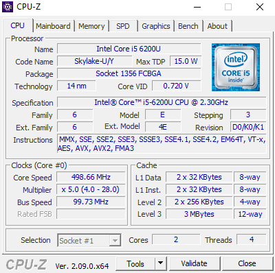
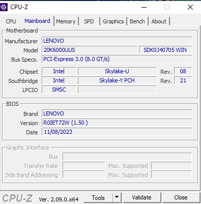
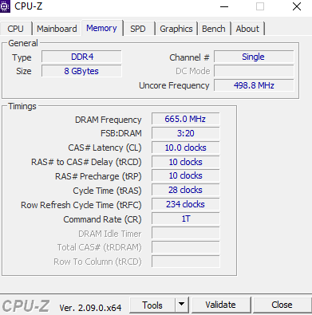
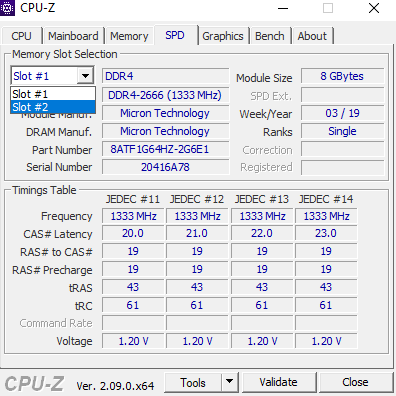
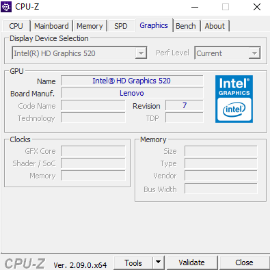
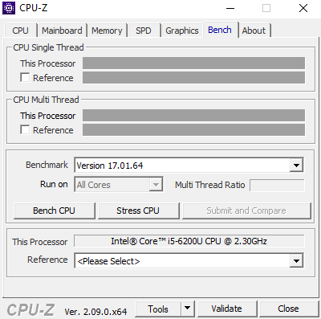

### NAMA : Sapta Adzani Purnama
### NRP : 3123521014
### Prodi : D3 Teknik Informatika-LA
### KELAS : A
# 1.ERD diagram proses booting

# 2.. Step Step Proses Booting : 
- PC Dinyalakan 
### Menyalakan komputer dengan cara menekan tombol fisik ON komputer, saat itulah proses booting dimulai.
- Pengecekan power pc
### Proses booting akan berjalan lancar jika power supply yang kamu gunakan cocok dengan daya listrik yang akan digunakan komputer dan aliran listrik berjalan normal.
- CPU aktif
### Pada proses ini, CPU akan mulai aktif bekerja untuk mendukung proses booting komputer
- Proses pengecekan perangkat keras
### Saat proses booting, komputer akan melakukan pengecekan hardware. Ini dilakukan oleh BIOS.
- Pemuatan driver
### Apabila hardware dalam keadaan baik, maka proses selanjutnya adalah pemuatan driver oleh komputer.
- Pemuatan VGA
### Pada tahap ini, GPU atau VGA akan berjalan dan akan muncul prosesnya secara visual pada layar monitormu. 
- OS dimuat
### Proses berikutnya adalah pengecekan dan pencarian boot sector oleh BIOS. 
- Loading OS
### Selanjutnya, komputer akan memproses sistem operasi pada komputermu, baik itu windows atau linux, dengan memunculkan tampilan logo pada layar. 
- Proses Selesai
### Akhirnya proses booting selesai, jika tidak terjadi masalah kamu akan sampai pada tampilan desktop komputer, berarti komputer bisa di gunakan.
# 3.Identifikasi Leptop:

- CPU

### Name CPU : Intel Core i5

### Code Name : Intel Skylake adalah mikroarsitektur prosesor yang pertama kali diperkenalkan oleh Intel pada tahun 2015. Sebagai bagian dari siklus perbaruan berkelanjutan dalam teknologi komputasi, Skylake menggantikan mikroarsitektur Broadwell yang sebelumnya.

### Technology : 14 nm, Nanometer adalah sebuah ukuran panjang yang sama dengan 1.0×10−9 meter — atau sepermilyar meter.

### Spesifikasi : Intel Core i5 6200u Generasi 6, Huruf "U" di belakang nomor seri seperti "Intel Core i5-6200U" merujuk pada kategori daya atau TDP (Thermal Design Power) dari prosesor tersebut. Prosesor dengan huruf "U" biasanya dirancang untuk perangkat dengan konsumsi daya rendah, seperti laptop tipis dan ultrabooks. Ini menunjukkan bahwa prosesor ini dioptimalkan untuk efisiensi energi dan dapat bekerja dengan daya yang lebih rendah dibandingkan dengan beberapa varian yang lebih berdaya.

### Memilki 2 Core dan 4 Threads. Core dan thread merupakan komponen yang dari CPU, core bertugas untuk melakukan dan mengeksekusi tugas, sedangkan thread berfungsi untuk memecah beban kerja core untuk meningkatkan efisiensi dan performa CPU.

- MAINBOARD

### Chipset: : Intel skyLake-U dengan Southbridge skyLake-Y PCH  fungsi PCH pada chipset Skylake-U dan Skylake-Y mencakup manajemen berbagai aspek dalam sistem, memastikan koordinasi dan pengaturan yang tepat antar-komponen untuk mendukung operasi yang efisien dan andal pada perangkat bergerak.

- MEMORY

### TYPE MEMORY DDR 4 : DDR4 adalah singkatan dari "Double Data Rate 4”, dan merupakan generasi keempat dari teknologi DDR, yang menggantikan SDRAM SDR (Single Data Rate). DDR4 memiliki tingkat transfer data yang lebih cepat, kapasitas yang lebih besar, dan voltase lebih rendah dibandingkan generasi sebelumnya.

### Size Ram yang saya pakai adalah 8 GB dan Memiliki Chanel singel, Chanel adalah komponen yang berguna sebagai jalur komukasi untuk mengakses data yang akan disimpan sementara di RAM.

- SPD

### Memiliki 2 slot memori dengan kecepatan DDR 4(DDR4 memiliki tingkat transfer data yang lebih cepat, kapasitas yang lebih besar, dan voltase lebih rendah dibandingkan generasi sebelumnya.)

### tipe memori yang di pakai di laptop ini adalah micron technology.

- GRAPHICS
A
### GPU yang di pakai i5 Version: **Intel® HD Graphics 520**

- BENCH
 
 ### BENCH untuk melakukan uji coba kecepatan skor prosesor dengan prosesor yang lain 

  

